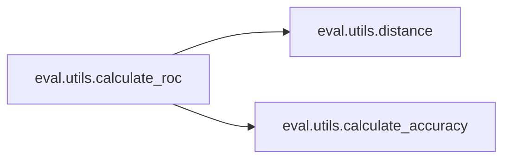
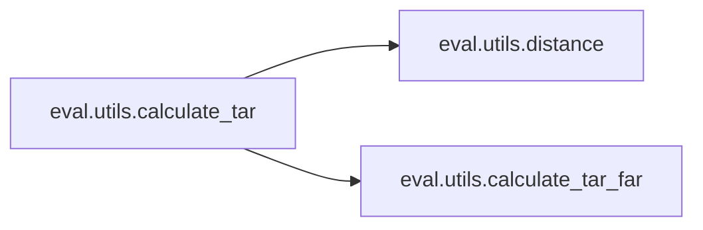

# Eval Utils

[_Documentation generated by Documatic_](https://www.documatic.com)

<!---Documatic-section-Codebase Structure-start--->
## Codebase Structure

<!---Documatic-block-system_architecture-start--->
```mermaid
None
```
<!---Documatic-block-system_architecture-end--->

# #
<!---Documatic-section-Codebase Structure-end--->

<!---Documatic-section-eval.utils.distance-start--->
## [eval.utils.distance](3-eval_utils.md#eval.utils.distance)

<!---Documatic-section-distance-start--->
<!---Documatic-block-eval.utils.distance-start--->
<details>
	<summary><code>eval.utils.distance</code> code snippet</summary>

```python
def distance(embeddings1, embeddings2, distance_metric=0):
    if distance_metric == 0:
        embeddings1 = embeddings1 / np.linalg.norm(embeddings1, axis=1, keepdims=True)
        embeddings2 = embeddings2 / np.linalg.norm(embeddings2, axis=1, keepdims=True)
        diff = np.subtract(embeddings1, embeddings2)
        dist = np.sum(np.square(diff), 1)
    elif distance_metric == 1:
        dot = np.sum(np.multiply(embeddings1, embeddings2), axis=1)
        norm = np.linalg.norm(embeddings1, axis=1) * np.linalg.norm(embeddings2, axis=1)
        similarity = dot / norm
        dist = np.arccos(similarity) / math.pi
    else:
        raise 'Undefined distance metric %d' % distance_metric
    return dist
```
</details>
<!---Documatic-block-eval.utils.distance-end--->
<!---Documatic-section-distance-end--->

# #
<!---Documatic-section-eval.utils.distance-end--->

<!---Documatic-section-eval.utils.calculate_roc-start--->
## [eval.utils.calculate_roc](3-eval_utils.md#eval.utils.calculate_roc)

<!---Documatic-section-calculate_roc-start--->


### Object Calls

* [eval.utils.distance](3-eval_utils.md#eval.utils.distance)
* [eval.utils.calculate_accuracy](3-eval_utils.md#eval.utils.calculate_accuracy)

<!---Documatic-block-eval.utils.calculate_roc-start--->
<details>
	<summary><code>eval.utils.calculate_roc</code> code snippet</summary>

```python
def calculate_roc(thresholds, embeddings1, embeddings2, actual_issame, distance_metric=0, nrof_folds=10):
    assert embeddings1.shape[0] == embeddings2.shape[0]
    assert embeddings1.shape[1] == embeddings2.shape[1]
    nrof_pairs = min(len(actual_issame), embeddings1.shape[0])
    nrof_thresholds = len(thresholds)
    k_fold = KFold(n_splits=nrof_folds, shuffle=False)
    tprs = np.zeros((nrof_folds, nrof_thresholds))
    fprs = np.zeros((nrof_folds, nrof_thresholds))
    accuracy = np.zeros(nrof_folds)
    dist = distance(embeddings1, embeddings2, distance_metric)
    indices = np.arange(nrof_pairs)
    for (fold_idx, (train_set, test_set)) in enumerate(k_fold.split(indices)):
        acc_train = np.zeros(nrof_thresholds)
        for (threshold_idx, threshold) in enumerate(thresholds):
            (_, _, acc_train[threshold_idx]) = calculate_accuracy(threshold, dist[train_set], actual_issame[train_set])
        best_threshold_index = np.argmax(acc_train)
        for (threshold_idx, threshold) in enumerate(thresholds):
            (tprs[fold_idx, threshold_idx], fprs[fold_idx, threshold_idx], _) = calculate_accuracy(threshold, dist[test_set], actual_issame[test_set])
        (_, _, accuracy[fold_idx]) = calculate_accuracy(thresholds[best_threshold_index], dist[test_set], actual_issame[test_set])
    tpr = np.mean(tprs, 0)
    fpr = np.mean(fprs, 0)
    return (tpr, fpr, accuracy)
```
</details>
<!---Documatic-block-eval.utils.calculate_roc-end--->
<!---Documatic-section-calculate_roc-end--->

# #
<!---Documatic-section-eval.utils.calculate_roc-end--->

<!---Documatic-section-eval.utils.calculate_accuracy-start--->
## [eval.utils.calculate_accuracy](3-eval_utils.md#eval.utils.calculate_accuracy)

<!---Documatic-section-calculate_accuracy-start--->
<!---Documatic-block-eval.utils.calculate_accuracy-start--->
<details>
	<summary><code>eval.utils.calculate_accuracy</code> code snippet</summary>

```python
def calculate_accuracy(threshold, dist, actual_issame):
    predict_issame = np.less(dist, threshold)
    tp = np.sum(np.logical_and(predict_issame, actual_issame))
    fp = np.sum(np.logical_and(predict_issame, np.logical_not(actual_issame)))
    tn = np.sum(np.logical_and(np.logical_not(predict_issame), np.logical_not(actual_issame)))
    fn = np.sum(np.logical_and(np.logical_not(predict_issame), actual_issame))
    tpr = 0 if tp + fn == 0 else float(tp) / float(tp + fn)
    fpr = 0 if fp + tn == 0 else float(fp) / float(fp + tn)
    acc = float(tp + tn) / dist.size
    return (tpr, fpr, acc)
```
</details>
<!---Documatic-block-eval.utils.calculate_accuracy-end--->
<!---Documatic-section-calculate_accuracy-end--->

# #
<!---Documatic-section-eval.utils.calculate_accuracy-end--->

<!---Documatic-section-eval.utils.calculate_tar_far-start--->
## [eval.utils.calculate_tar_far](3-eval_utils.md#eval.utils.calculate_tar_far)

<!---Documatic-section-calculate_tar_far-start--->
<!---Documatic-block-eval.utils.calculate_tar_far-start--->
<details>
	<summary><code>eval.utils.calculate_tar_far</code> code snippet</summary>

```python
def calculate_tar_far(threshold, dist, actual_issame):
    predict_issame = np.less(dist, threshold)
    true_accept = np.sum(np.logical_and(predict_issame, actual_issame))
    false_accept = np.sum(np.logical_and(predict_issame, np.logical_not(actual_issame)))
    n_same = np.sum(actual_issame)
    n_diff = np.sum(np.logical_not(actual_issame))
    tar = float(true_accept) / float(n_same)
    far = float(false_accept) / float(n_diff)
    return (tar, far)
```
</details>
<!---Documatic-block-eval.utils.calculate_tar_far-end--->
<!---Documatic-section-calculate_tar_far-end--->

# #
<!---Documatic-section-eval.utils.calculate_tar_far-end--->

<!---Documatic-section-eval.utils.calculate_tar-start--->
## [eval.utils.calculate_tar](3-eval_utils.md#eval.utils.calculate_tar)

<!---Documatic-section-calculate_tar-start--->


### Object Calls

* [eval.utils.distance](3-eval_utils.md#eval.utils.distance)
* [eval.utils.calculate_tar_far](3-eval_utils.md#eval.utils.calculate_tar_far)

<!---Documatic-block-eval.utils.calculate_tar-start--->
<details>
	<summary><code>eval.utils.calculate_tar</code> code snippet</summary>

```python
def calculate_tar(thresholds, embeddings1, embeddings2, actual_issame, far_target, nrof_folds=10, distance_metric=0, subtract_mean=False):
    assert embeddings1.shape[0] == embeddings2.shape[0]
    assert embeddings1.shape[1] == embeddings2.shape[1]
    nrof_pairs = min(len(actual_issame), embeddings1.shape[0])
    nrof_thresholds = len(thresholds)
    k_fold = KFold(n_splits=nrof_folds, shuffle=False)
    tar = np.zeros(nrof_folds)
    far = np.zeros(nrof_folds)
    indices = np.arange(nrof_pairs)
    for (fold_idx, (train_set, test_set)) in enumerate(k_fold.split(indices)):
        if subtract_mean:
            mean = np.mean(np.concatenate([embeddings1[train_set], embeddings2[train_set]]), axis=0)
        else:
            mean = 0.0
        dist = distance(embeddings1 - mean, embeddings2 - mean, distance_metric)
        far_train = np.zeros(nrof_thresholds)
        for (threshold_idx, threshold) in enumerate(thresholds):
            (_, far_train[threshold_idx]) = calculate_tar_far(threshold, dist[train_set], actual_issame[train_set])
        if np.max(far_train) >= far_target:
            f = interpolate.interp1d(far_train, thresholds, kind='slinear')
            threshold = f(far_target)
        else:
            threshold = 0.0
        (tar[fold_idx], far[fold_idx]) = calculate_tar_far(threshold, dist[test_set], actual_issame[test_set])
    tar_mean = np.mean(tar)
    far_mean = np.mean(far)
    tar_std = np.std(tar)
    return (tar_mean, tar_std, far_mean)
```
</details>
<!---Documatic-block-eval.utils.calculate_tar-end--->
<!---Documatic-section-calculate_tar-end--->

# #
<!---Documatic-section-eval.utils.calculate_tar-end--->

[_Documentation generated by Documatic_](https://www.documatic.com)